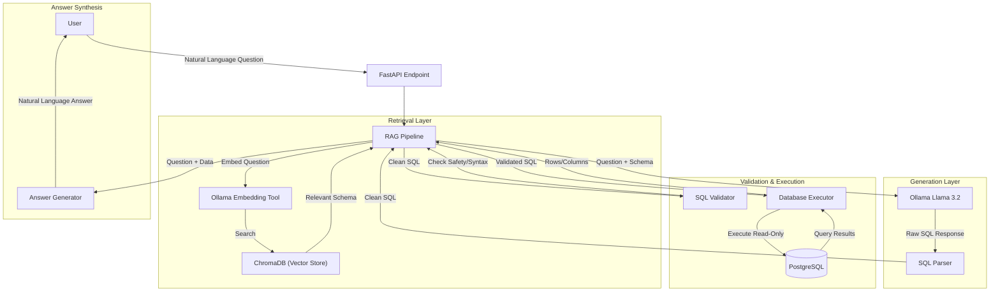

# System Architecture: Chat with SQL

This document provides a deep dive into the technical design, data flow, and component interactions of the Chat with SQL system.

## 🏗️ High-Level Overview

The system follows a RAG (Retrieval-Augmented Generation) pattern specifically tailored for SQL generation. It bridges the gap between natural language questions and relational data by dynamically retrieving relevant schema metadata to construct precise and safe SQL queries.

## 🧩 Core Components

### 1. Schema Indexer (`app/core/schema_indexer.py`)
- **Responsibility**: Converts the database schema into searchable semantic embeddings.
- **Workflow**:
    1. Extracts tables, columns, primary keys, and foreign key relationships.
    2. Constructs a descriptive text document for each table.
    3. Embeds documents using `nomic-embed-text` via Ollama.
    4. Stores embeddings in a persistent `ChromaDB` collection.
- **Retrieval Logic**: Uses vector search to find the top $K$ most relevant tables and then *expands* the context by recursively including tables linked by foreign keys.

### 2. SQL Generator (`app/core/sql_generator.py`)
- **Responsibility**: Translates user questions into PostgreSQL-compatible SQL.
- **Rules Engine**: Enforces strict system prompting (Read-only, alias usage, column qualification, LIMIT clauses).
- **Ambiguity Handler**: Pre-screens questions for vagueness (e.g., "show performance") and requests clarification before wasting tokens.

### 3. SQL Validator (`app/core/sql_validator.py`)
- **Responsibility**: Acts as a security firewall.
- **Mechanisms**:
    - **Keyword Blocking**: Rejects any non-`SELECT` statements (INSERT, DROP, etc.).
    - **Schema Bound**: Verifies that extracted table names exist within the retrieved context.
    - **Injection Check**: Detects stacked queries and common SQL injection patterns.

### 4. Database Executor (`app/core/db_executor.py`)
- **Responsibility**: Connects to PostgreSQL and manages query execution.
- **Safety**:
    - Forces `READ ONLY` session mode.
    - Implements `statement_timeout` to prevent long-running queries from hanging the server.
- **Self-Healing**: If a query fails due to a syntax error, it passes the error back to the LLM for a one-time automated correction attempt.

### 5. Answer Generator (`app/core/answer_generator.py`)
- **Responsibility**: Converts dry database rows into a "human" summary.
- **Logic**: Feeds the question, the SQL used, and the top result rows back to the LLM to synthesize a conversational answer.

---

## 🚦 Data Flow

1. **User Request**: "Who are my top 5 customers in India?"
2. **Schema Retrieval**: ChromaDB finds the `customers` table and its relationships.
3. **SQL Generation**: LLM generates `SELECT name FROM customers WHERE country ILIKE 'India' LIMIT 5;`.
4. **Validation**: Validator confirms it's a `SELECT` and uses allowed tables.
5. **Execution**: Executor runs the query on PostgreSQL.
6. **Synthesis**: LLM summarizes: "Your top customers in India are [Name1], [Name2], etc."
